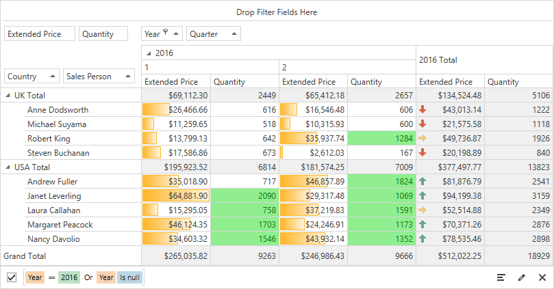

<!-- default badges list -->

<!-- default badges end -->

# Pivot Grid for WPF - How to apply format conditions to data cells

This example shows how to add format conditions to [WPF Pivot Grid Control](https://docs.devexpress.com/WPF/7228/controls-and-libraries/pivot-grid).

The **Data Bar** conditional formatting is applied to the 'Extended Price' measure and intersection of the 'Sales Person' and 'Quarter' fields. This condition formats data cells with a predefined orange gradient data bar. The condition was created in c# code.

The **Top Bottom Rule** conditional formatting is applied to the 'Quantity' measure and intersection of the 'Sales Person' and 'Quarter' fields. This condition formats data cells whose values are above average with green text and light green fill. The condition was created using the [Conditional Formatting Rules Manager](https://docs.devexpress.com/WPF/114038/controls-and-libraries/pivot-grid/data-analysis/conditional-formatting#conditional-formatting-rules-manager).

The **Icon Set** conditional formatting is applied to the 'Extended Price' measure and intersection of the 'Sales Person' and 'Year' fields. This condition displays a specific icon in a cell according to the range to which this cell value belongs. The condition was created using the Conditional Formatting Rules Manager.

## Files to Review

* [MainWindow.xaml](./CS/WpfPivotGridConditionalFormatting/MainWindow.xaml) (VB: [MainWindow.xaml](./VB/WpfPivotGridConditionalFormatting/MainWindow.xaml))
* [MainWindow.xaml.cs](./CS/WpfPivotGridConditionalFormatting/MainWindow.xaml.cs) (VB: [MainWindow.xaml.vb](./VB/WpfPivotGridConditionalFormatting/MainWindow.xaml.vb))

## Documentation

* [Conditional Formatting](https://docs.devexpress.com/WPF/114038/controls-and-libraries/pivot-grid/data-analysis/conditional-formatting)
* [Applying Conditional Formatting](https://docs.devexpress.com/WPF/114395/controls-and-libraries/pivot-grid/end-user-capabilities/applying-conditional-formatting)
<!-- feedback -->
## Does this example address your development requirements/objectives?

 

(you will be redirected to DevExpress.com to submit your response)
<!-- feedback end -->
